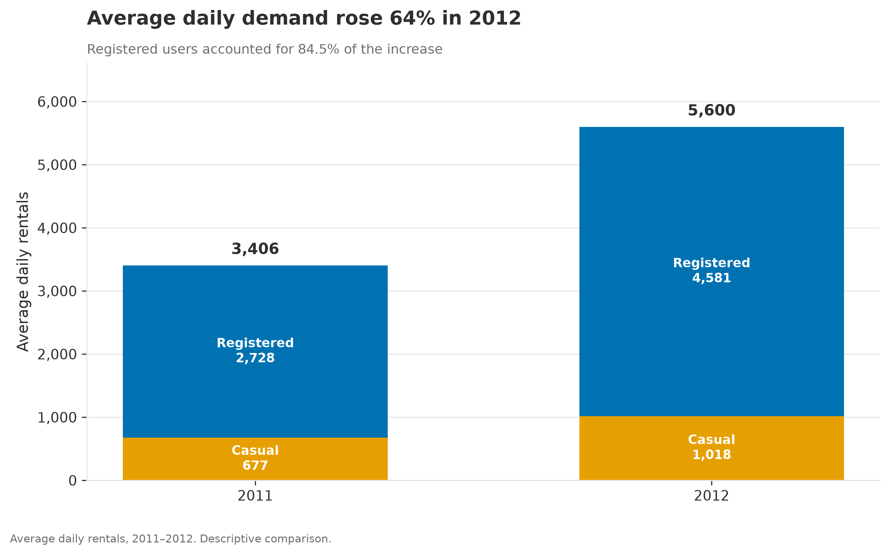
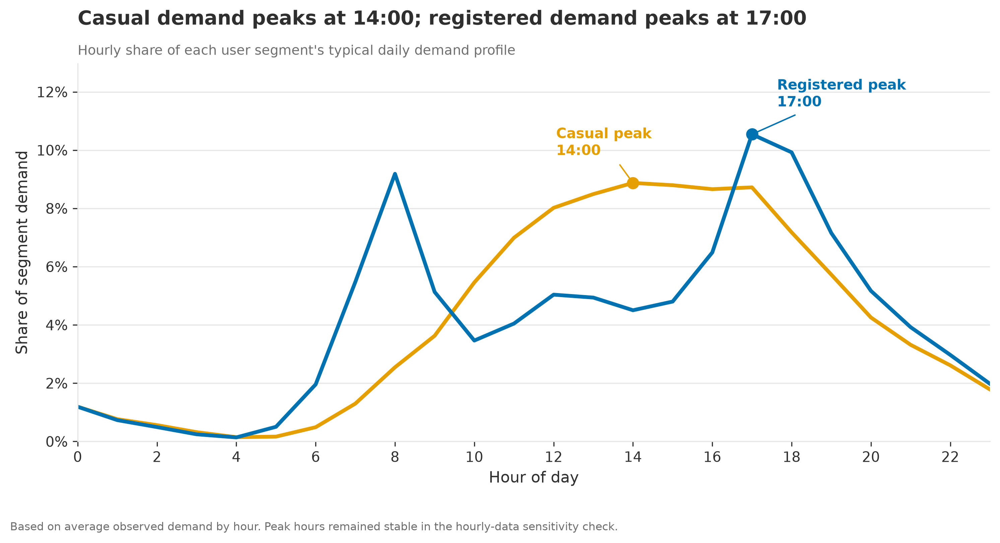
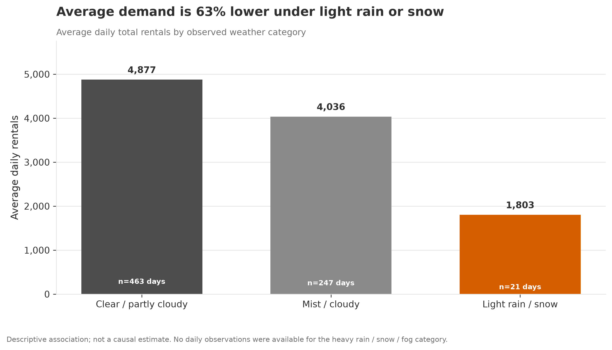

# Bike-Sharing Demand Analysis

This project looks at how bike-sharing demand changed across years, user segments, day types, hours of the day, and weather conditions.

I built the analysis as an end-to-end workflow: audit the raw data, clean and validate it, explore the main demand patterns, reproduce the JMP regression baseline in Python, account for time dependence in the residuals, and turn the results into a small set of presentation-ready figures and a management report.

The goal is not to make causal or forecasting claims. It is to understand the historical demand patterns that are most useful for operational planning.

## Project overview

The project uses:

- **731 daily observations**
- **17,379 hourly observations**
- Data from **January 2011 through December 2012**
- Separate rental counts for **casual** and **registered** users
- Calendar and weather variables including season, weekday, holiday status, working-day status, weather condition, temperature, humidity, and windspeed

The daily dataset is used for broader demand analysis and regression modeling. The hourly dataset is used to study within-day demand peaks and differences between casual and registered users.

## Questions I wanted to answer

1. How did daily demand change from 2011 to 2012?
2. Which user segment contributed most to that growth?
3. How does demand vary by month, weekday, working-day status, and hour?
4. How different are casual and registered users?
5. Which weather and calendar conditions are associated with higher or lower demand?
6. What practical operating insights are supported by the data?

## Key findings

- Average daily rentals were **64.4% higher in 2012** than in 2011.
- Registered users accounted for **84.5% of the observed increase**.
- Average demand in 2012 was higher than the corresponding 2011 level in all 12 months.
- Registered-user demand was concentrated around **08:00 and 17:00**, with the highest average hourly level at **17:00**.
- Casual-user demand followed a broader daytime pattern and peaked at **14:00**.
- Average weekend casual demand was **124.3% higher** than the Monday-to-Friday average.
- Registered users represented **86.8% of working-day rentals**.
- Average demand during light rain or snow was about **63.0% lower** than under clear or partly cloudy conditions, although the adverse-weather sample was small.

These findings describe historical patterns and adjusted statistical associations. They should not be interpreted as causal effects or validated forecasts.

## Selected figures

### Annual demand growth and segment contribution



### Hourly demand profiles by user segment



### Demand by weather condition



## Analysis workflow

### 1. Data audit

The first notebook checks the structure of both datasets before any cleaning takes place. This includes observation counts, missing values, duplicates, category ranges, date coverage, rental-count identities, hourly completeness, and consistency between the daily and hourly files.

### 2. Data cleaning

The cleaning stage parses dates and timestamps, adds readable labels and data-quality flags, preserves the original rental counts, sorts the data chronologically, and exports validated clean datasets for the rest of the analysis.

### 3. Exploratory analysis

The exploratory notebook looks at annual and monthly demand, user composition, weekdays, working and non-working days, hourly demand profiles, weather conditions, and sensitivity to incomplete hourly coverage.

### 4. Time-series regression

The OLS baseline for total daily demand was first estimated in JMP and then reproduced in Python.

After checking the OLS residuals, I evaluated autoregressive error structures to account for the strong time dependence in daily demand. Separate models were then estimated for:

- Total rentals
- Casual-user rentals
- Registered-user rentals

The preferred models include calendar and weather variables together with daily and weekly autoregressive error terms.

### 5. Communication

The final notebook turns the validated results into a focused set of explanatory charts. The project also includes structured CSV outputs, diagnostic files, JMP work, and a management report.

## Modeling approach

The total-demand and registered-user models use working-day status. The casual-user model uses separate weekday and holiday effects because that specification better reflects the weekly pattern observed in casual demand.

Each preferred model includes:

- Year
- Season
- Calendar effects
- Weather category
- Temperature
- Humidity
- Windspeed
- A daily AR(1) error structure
- A weekly seasonal AR(1) error structure with a seven-day period

The autoregressive models substantially reduced the short-term residual autocorrelation found in the OLS baselines. Some serial dependence remained, especially in the casual-user model, so I use the models for adjusted historical interpretation rather than forecasting.

## Data quality checks

The audit found:

- No missing cells in the supplied files
- No exact duplicate records
- No negative rental counts
- Category values within their expected ranges
- `cnt = casual + registered` for every observation

Two issues were documented rather than silently corrected:

- **DQ-01:** 165 expected date-hour combinations were absent across 76 dates.
- **DQ-02:** Humidity was recorded as zero on March 10, 2011.

The original values were retained. A sensitivity check showed that the main casual, registered, and total peak hours were unchanged when the hourly analysis was restricted to dates with complete 24-hour coverage.

## Repository structure

```text
bike-sharing-demand-analysis/
├── README.md
├── requirements.txt
├── .gitignore
│
├── 01_data/
│   ├── raw/
│   └── clean/
│
├── 02_python/
│   └── notebooks/
│       ├── 01_data_audit.ipynb
│       ├── 02_data_cleaning.ipynb
│       ├── 03_exploratory_data_analysis.ipynb
│       ├── 04_time_series_regression.ipynb
│       └── 05_explanatory_visualizations.ipynb
│
├── 03_jmp/
│
├── 04_outputs/
│   ├── diagnostics/
│   ├── figures/
│   │   ├── exploratory/
│   │   └── presentation/
│   └── tables/
│
├── 05_reports/
│   └── bike_sharing_management_report.pdf
│
├── 06_documentation/
│   └── software_environment.md
│
└── 07_portfolio/
    └── portfolio_case_study.md
```

## Running the project

The notebooks are designed to be run in numeric order:

```text
01_data_audit.ipynb
02_data_cleaning.ipynb
03_exploratory_data_analysis.ipynb
04_time_series_regression.ipynb
05_explanatory_visualizations.ipynb
```

### 1. Create the Python environment

From the repository root:

```bash
python -m venv .venv
```

Activate the environment, then install the dependencies:

```bash
pip install -r requirements.txt
```

### 2. Start Jupyter from the notebook folder

```bash
cd 02_python/notebooks
jupyter notebook
```

Starting Jupyter from this folder keeps the relative project paths used in the notebooks consistent.

### 3. Run the notebooks in order

Running the notebooks from `01` through `05` regenerates the clean datasets, analytical tables, diagnostics, exploratory figures, and presentation figures.

The exact software versions used for the project are also documented in:

```text
06_documentation/software_environment.md
```

## Tools

- **Python 3.13.13**
- **pandas 3.0.3**
- **NumPy 2.4.6**
- **statsmodels 0.14.6**
- **matplotlib 3.11.0**
- **SciPy 1.18.0**
- **patsy 1.0.2**
- **Jupyter 1.1.1**
- **JMP Pro 17**

## Main deliverables

- [Management report — PDF](05_reports/bike_sharing_management_report.pdf)
- Clean daily and hourly datasets
- Five Python notebooks covering the full analytical workflow
- JMP analysis files and reports
- Structured descriptive and model outputs
- Exploratory and presentation-ready figures
- Data-quality and model-diagnostic files
- [Portfolio case study](07_portfolio/portfolio_case_study.md)

## Limitations

This project has several important limits:

- The data cover only two years.
- The analysis is observational and does not establish causality.
- The available records are aggregated at the system level.
- Station inventory, bicycle and dock availability, origin-destination data, stockouts, service interruptions, operating costs, and unmet demand are not available.
- The adverse-weather sample is limited.
- The preferred models still show some remaining residual dependence.
- The models were not validated as forecasting systems.

Because of these limitations, the analysis can identify when demand deserves more operational attention, but it cannot determine exactly how many bicycles should be moved, which stations require intervention, or whether fleet expansion would be financially justified.

## Data source

The raw `day.csv` and `hour.csv` files come from the **Bike Sharing** dataset in the UCI Machine Learning Repository. The dataset contains daily and hourly rental counts from the Capital Bikeshare system for 2011 and 2012, together with weather and seasonal information.

**Citation:**  
Fanaee-T, H. (2013). *Bike Sharing* [Dataset]. UCI Machine Learning Repository.  
DOI: https://doi.org/10.24432/C5W894

UCI lists the dataset under the **Creative Commons Attribution 4.0 International (CC BY 4.0)** license.

Dataset page: https://archive.ics.uci.edu/dataset/275/bike+sharing+dataset

## Author

**Fatemeh Kamrani**
